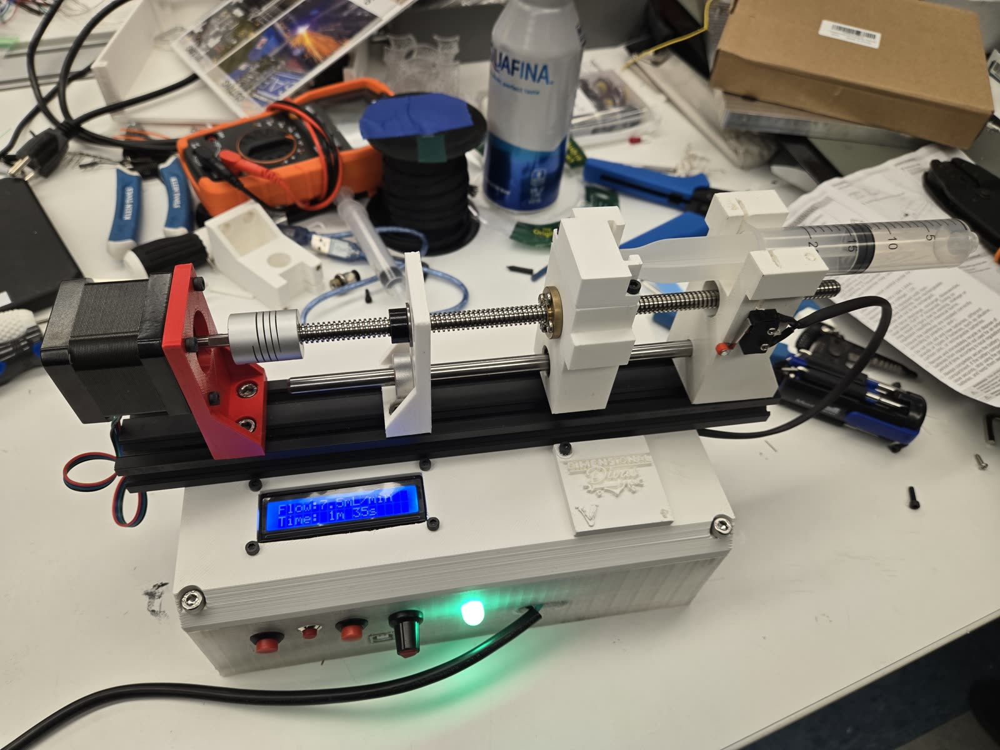

# Syringe Pump

I designed and built this syringe pump from scratch: a stepper-driven lead screw
pushes a syringe plunger at a flow rate you dial in on a potentiometer, with an
LCD showing the rate and the time left, and limit-switch and LED interlocks
handled in Arduino firmware I wrote.



## How it works

- A NEMA 17 stepper turns an 8 mm lead screw through a flexible coupling, so the
  plunger speed, and with it the flow rate, is set directly by the step rate.
- The firmware turns a commanded flow rate in mL/min into steps per second from
  the syringe's plunger area and the screw lead, then drives an A4988 at 1/16
  microstepping through AccelStepper.
- A potentiometer sets the rate live in 0.1 mL/min steps. It is wired backwards,
  so `POT_REVERSED` flips it in software, and the reading is smoothed with an
  exponential moving average and a deadband to stop the setpoint flickering.
- A normally-closed limit switch stops the motor and lights a red LED at the end
  of travel, two jog buttons reposition the carriage, and an RGB LED shows
  running, paused or empty.

## Numbers

Measured by building the firmware and running the host test suite, not on a
bench with a scale. Everything else, including the flow range, is in
[docs/hardware.md](docs/hardware.md).

| | |
|---|---|
| Flash used | 14,426 of 32,256 bytes (44%) |
| RAM used | 791 of 2,048 bytes (38%) |
| Steps per revolution | 3,200 |
| Flow rate range | 0 to 7.5 mL/min, 0.1 mL/min steps |
| Host unit tests | 40, all passing |

## Build and flash

```
arduino-cli core install arduino:avr
arduino-cli lib install AccelStepper "LiquidCrystal I2C"
arduino-cli compile --fqbn arduino:avr:uno SyringePump
arduino-cli upload -p <PORT> --fqbn arduino:avr:uno SyringePump
```

I no longer have the hardware, so the pump math and the state machine live in
`pump_core.h/.cpp` and are unit tested on a PC with GoogleTest against the
original firmware's numbers: `cmake -S . -B build && cmake --build build && ctest --test-dir build`.

MIT licensed.
