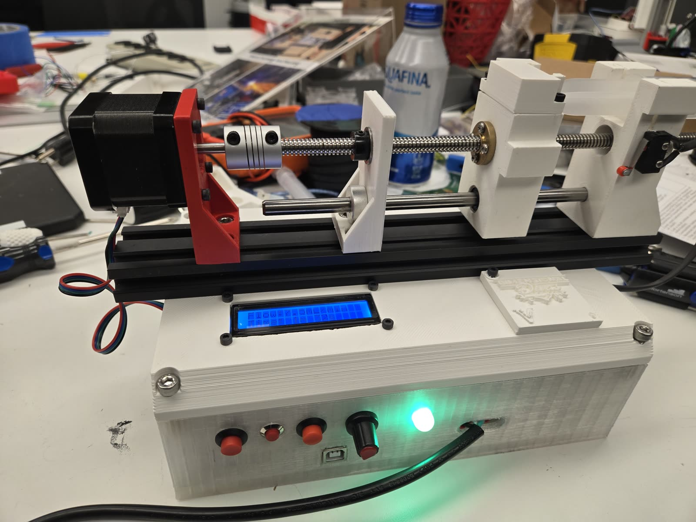
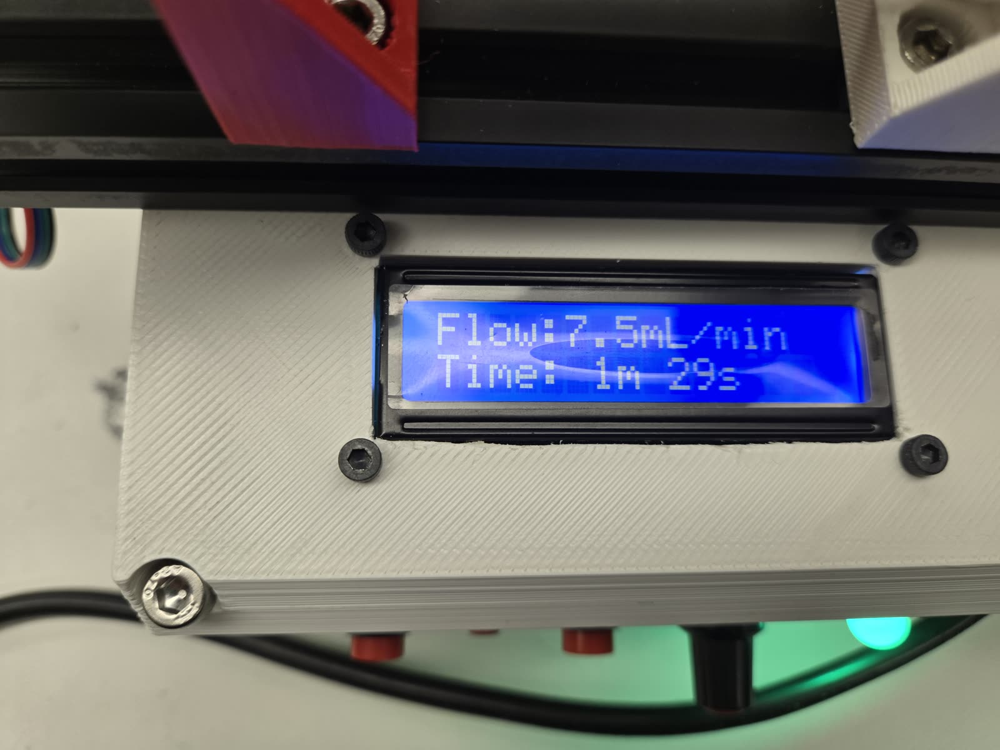
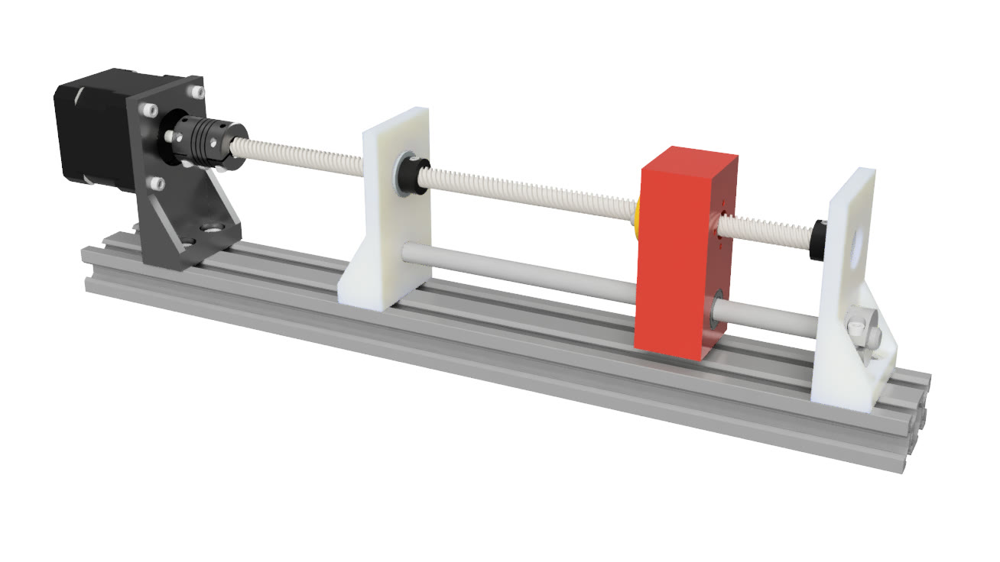

# Hardware notes

Everything here is about the physical build. The README has the short version.

## More photos

Short clip of it running: [pump-demo.mp4](pump-demo.mp4)

## Parts

NEMA 17 stepper, A4988 driver, Arduino Uno, 24 V supply, 250 mm lead screw
with 8 mm lead and a flexible coupling, 8 mm linear rods with LM8UU bearings,
2020/2040 aluminium extrusion, 16x2 I2C LCD, 10k potentiometer, latching push
button, two momentary jog buttons, limit switch, common-cathode RGB LED. The
frame, carriage, syringe clamp and enclosure are 3D printed.

Logic runs on 5 V from the Arduino. The motor is powered separately at 24 V
through the A4988.

## Wiring

| Signal | Pin |
|---|---|
| Stepper STEP / DIR | D2 / D3 |
| Start/pause button | D7 |
| Limit switch (NC) | D8 |
| Jog forward / reverse | D4 / D5 |
| Potentiometer | A0 |
| Status LED (G/B/R) | D9 / D10 / D11 |
| LCD | I2C (SDA/SCL), address 0x27 |

## Calculated specs

These come from the firmware constants and the geometry, not from a bench
measurement with a scale.

| Parameter | Value |
|---|---|
| Motor / driver | NEMA 17 + A4988 at 1/16 microstepping, 3200 steps/rev |
| Lead screw | 250 mm, 8 mm lead |
| Syringe sizes | 10 mL (14.7 mm plunger) and 20 mL (19.1 mm plunger) |
| Flow rate range | 0 to 7.5 mL/min, 0.1 mL/min resolution |
| Control board | Arduino Uno |

## The potentiometer is backwards

The pot is wired so its ADC reading falls as the knob turns toward "faster".
`POT_REVERSED` in `pump_core.h` flips it in software so a reading of 0 maps to
maximum flow. If you rewire the pot, flip that constant too or the knob will
work the wrong way round. The raw reading is smoothed with an exponential
moving average (alpha 0.2) and a 4-count deadband so wiper jitter does not
make the setpoint flicker.
